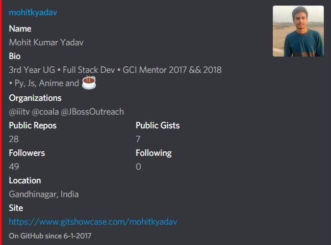

# 🌜⚽⚽👢ME bot

[](https://raw.githubusercontent.com/mohitkyadav/coolme/master/LICENSE)
[](https://github.com/mohitkyadav/coolme)
[](https://discord.gg/bJGQRJx)

## Deployable on

```
glitch / zeit / heroku.
```

## List of supported commands

| Command                    | Response                            | Status |
| -------------------------- | ----------------------------------- | ------ |
| _!hello_                   | **world!**                          | ✔      |
| _!yo_                      | **lo!😜**                           | ✔      |
| _!status_                  | **server status(200/404)**          | ✔      |
| _!cool `<string>`_         | \***\*All cool strings\*\***        | ✔      |
| _!uncool `<string>`_       | \***\*original string\*\***         | ✔      |
| _!weather `<city_name>`_   | \***\*weather information\*\***     | ✔      |
| _!ytt_                     | \***\*Top trending on YouTube\*\*** | ✔      |
| _!twt_                     | \***\*Top trending on Twitter\*\*** | ✔      |
| _!ip `<url>`_              | \***\*ip address of the url\*\***   | ✔      |
| _!gcard `github_username`_ | \***\*Embeded GitHub Card\*\***     | ✔      |
| _!encrypt `text` `key`_    | \***\*Encrypted text\*\***          | ⏰     |
| _!decrypt `text` `key`_    | \***\*Decrypted text\*\***          | ⏰     |

# Examples

> !gcard mohitkyadav



> !gcard google


## Environment variables

You need to set these variables in your deployment environment. A `sample.env` file has been provided for reference. You can set the values there and rename it to .env for local development.
| env variable | value |
|--|--|
|`TOKEN`|Discord client token|
|`OWKEY`|Open weather map API key|
|`YTKEY`|Youtube API key|
|`PORT`|Set automatically by your deployment platform|
|`MAG_GIF`|Rich embed default thumbnail url|
|`TWAPIKEY`|Twitter consumer key|
|`TWAPISECRET`|Twitter consumer secret|
|`TWACCESS`|Twitter access token|
|`TWACCESSSECRET`|Twitter access token secret|
